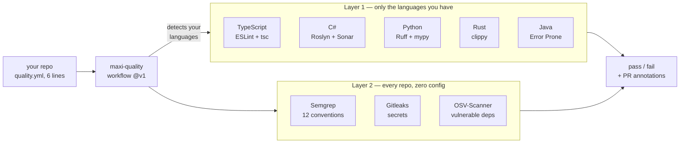

# maxi-quality

Strict linting and security scanning for TypeScript, C#, Python, Rust and Java,
consumed from one repo instead of rebuilt in every project.

[](https://github.com/maximalcode/maxi-quality/actions/workflows/ci.yml)
[](https://github.com/maximalcode/maxi-quality/tags)
[](LICENSE)
[](https://scorecard.dev/viewer/?uri=github.com/maximalcode/maxi-quality)


**Who this is for:** you maintain more than one repo, and you want
typescript-eslint `strict-type-checked`, Roslyn analyzers, Ruff + mypy `strict`,
clippy `pedantic`, plus secret and dependency scanning — without designing that
stack yourself and re-tuning it in every project. You add one file. The rules
live here, and they are versioned here.

Free tools only: OSS analyzers plus the GitHub Actions free tier.

---

## Before you adopt

This repo is **public and genuinely adoptable, and supported for nobody.** Both
halves are meant literally, and they are worth two minutes before you wire
anything up.

**The supported stack.** Inside it, things are expected to work and a failure is
a bug worth reporting. Outside it, you are out of scope rather than broken:

| | Supported |
|---|---|
| Languages | TypeScript · C# / .NET · Python · Rust · Java (**Maven only** — Gradle fails loud rather than skipping) |
| Package managers | npm · pnpm · pip / uv · Cargo · Maven. **yarn and bun are a hard exit** |
| CI | GitHub Actions. Nothing else is attempted |

**What you are owed: the tag, and nothing else.** Issues and pull requests from
outside carry no promise of a response, and no language or tool gets added
because someone outside asks for it. What the tag promises:

- A **new finding is not a breaking change.** New rules, analyzer bumps and
  tightened configs land on `@v1` and can turn a green build red. That is the
  product working — ratcheting up is the point — and `--changed-only` is how you
  grandfather an existing backlog on day one.
- A **mechanism change is breaking**, and gets a new major tag instead: an input
  removed or renamed, a job renamed, detection behaviour altered, or anything
  new you must have in your own repo.
- **Do not SHA-pin `quality.yml`.** Your Scorecard will ask you to. The pinned
  workflow text still resolves `actions/layer2@v1` one level down, so the pin
  would look real and protect nothing. Pin a **`v1.0.x`** tag instead if you
  need a ref that never moves.

**What this does not do.** Stated because a gate that stays quiet about its
edges gets trusted past them:

- **No SARIF upload, no code-scanning integration.** Findings land in the job
  log and on the PR diff.
- **No preflight.** You cannot find out what Layer 1 will cost your repo without
  running it — start with `--changed-only`.
- **No `.pre-commit-hooks.yaml`.** The hook is installed by `adopt.sh --hooks`,
  not consumed by the pre-commit framework.
- **No judgement about whether code should exist.** See Limits.

---

## Quick start

### A new repo

This is the entire adoption. One file, six lines:

```yaml
# .github/workflows/quality.yml
name: quality
on: [push, pull_request]
jobs:
  quality:
    uses: maximalcode/maxi-quality/.github/workflows/quality.yml@v1
```

No token, no secrets, no checkout of this repo. Every push and pull request now
runs Semgrep, Gitleaks and OSV-Scanner.

### A repo that already exists

Same file, two more lines. Your whole existing backlog is grandfathered on day
one, and the gate still fails on anything new:

```yaml
name: quality
on: [push, pull_request]
jobs:
  quality:
    uses: maximalcode/maxi-quality/.github/workflows/quality.yml@v1
    with:
      changed-only: origin/main   # only fail on code changed since this ref
      languages: 'none'           # Layer 2 only, for now
```

Worked example: [`examples/legacy-ratchet/`](examples/legacy-ratchet/).

### Adding the deep per-language checks

`adopt.sh` detects your languages, copies the two or three files per language
that ESLint, .NET and Cargo cannot load from a remote repo, and writes the
workflow above:

```bash
git clone https://github.com/maximalcode/maxi-quality.git
./maxi-quality/scripts/adopt.sh <your-repo> --dry-run   # prints every action, writes nothing
./maxi-quality/scripts/adopt.sh <your-repo>
```

It never overwrites a file without `--force`, and re-running it is safe.

A new repo goes from `git init` to failing CI on a planted bug in under ten
minutes, using only this page. CI here asserts it: a repo adopted by the script
rejects the bad fixture with exactly the same 23 errors as the hand-configured
sample. Full walkthrough in [`docs/ADOPTION.md`](docs/ADOPTION.md), copyable
repos in [`examples/`](examples/).

---

## How it works



**Layer 2** is identical for every repo, whatever it is written in: Semgrep
running this repo's 12 conventions, Gitleaks for secrets, OSV-Scanner for
vulnerable dependencies. It needs no config in your repo at all.

**Layer 1** is your own compiler and linter turned up: typescript-eslint
`strict-type-checked`, Roslyn with SonarAnalyzer and Roslynator under
`TreatWarningsAsErrors`, Ruff with mypy `strict`, and clippy `pedantic` with
`-Dwarnings`. It runs inside your build, so it needs a few files copied in.

| | Layer 2 | Layer 1 |
|---|---|---|
| Scope | every repo, any stack | per language, only the ones you have |
| Config in your repo | none | 2–3 files |
| Runs as | one CI job, no token | your own build and lint step |
| Catches | secrets, vulnerable deps, injection, conventions | type holes, floating promises, dead code, undisposed resources |
| Grandfathers your backlog | **yes** | **no** |

---

## Start with Layer 2

Semgrep supports `--baseline-commit`, so Layer 2 can be told to fail only on
code changed since a given ref. ESLint, Roslyn and mypy have no equivalent: a
rule is either on and failing your build, or off. That makes Layer 1
all-or-nothing per rule, and adopting it on an existing codebase is a cleanup
sprint rather than a config change.

Here is what each layer actually cost on real codebases:

| | First-run findings | What it took to go green |
|---|---|---|
| Layer 2, Consumer A | 57 (70 before rule tuning) | one line of YAML, all deferred |
| Layer 2, Consumer B | 15 (17 before tuning) | same |
| Layer 1 Python, Consumer C | already clean | one line of `per-file-ignores` |
| Layer 1 C#, Consumer A | 197 (~120 after tuning) | fix them |
| Layer 1 TypeScript, Consumer A | 445 | fix them |
| Layer 1 TypeScript, Consumer B | 4,902 | fix them |

Consumer A is a private C# and TypeScript monorepo, Consumer B a private
TypeScript app, Consumer C a private Python service. The numbers are real, the
names are private. Full detail in [`docs/STATUS.md`](docs/STATUS.md).

So turn on Layer 2 first. It is one line, it defers your backlog, and it is the
half that catches leaked credentials and vulnerable dependencies. Add Layer 1
one language at a time, when someone has the week to spend on it.

---

## What you get

| Area | What it is | Where |
|---|---|---|
| TypeScript | ESLint `strict-type-checked` + sonarjs, shared `tsconfig` | [`configs/typescript/`](configs/typescript/) |
| C# / .NET | Roslyn + SonarAnalyzer + Roslynator, warnings as errors | [`configs/dotnet/`](configs/dotnet/) |
| Python | Ruff, 13 rule families, plus mypy `strict` | [`configs/python/`](configs/python/) |
| Rust | clippy `pedantic`, rustfmt, cargo-deny, `unsafe_code` forbidden | [`configs/rust/`](configs/rust/) |
| Java | Error Prone + NullAway at ERROR, `-Xlint:all -Werror`, Spotless/palantir (AOSP). **Maven only** | [`configs/java/`](configs/java/) |
| Custom rules | Semgrep: 12 conventions, 40 rule ids | [`semgrep/`](semgrep/) |
| Dead code and unused dependencies | knip (TypeScript) and deptry (Python), gating the measured issue types only | [`actions/deadcode/`](actions/deadcode/) |
| Secrets and dependencies | Gitleaks and OSV-Scanner behind one runner | [`scripts/scan.sh`](scripts/scan.sh) |
| CI | reusable workflow, pinned by the `@v1` tag | [`quality.yml`](.github/workflows/quality.yml) |
| PR feedback | findings annotated on the diff, on by default | [#40](https://github.com/maximalcode/maxi-quality/issues/40) |
| Per-repo policy | disable or downgrade rules, exclude paths, add your own | `.maxi-quality.yml` |
| Pre-commit hook | opt-in, runs on staged content, `--no-verify` always works | `adopt.sh --hooks` |
| Coverage | a ratchet on the whole repo, plus a threshold on the lines a change adds. One line once your test job uploads a report | [ADOPTION §8](docs/ADOPTION.md#8-coverage--a-ratchet-on-the-repo-a-threshold-on-the-diff) |
| SBOM and licence gate | both from OSV-Scanner; the SBOM never gates | [`docs/REFERENCE.md`](docs/REFERENCE.md) |
| Formatting | Prettier, `ruff format`, `dotnet format whitespace`, gated in CI | [#42](https://github.com/maximalcode/maxi-quality/issues/42) |
| Editor defaults | one shared `.editorconfig` | [`configs/editorconfig`](configs/editorconfig) |
| Editor parity | the settings that make the official extensions show what CI shows, written for the languages you actually have | `adopt.sh --editor` |
| Copyable examples | seven complete consumer repos, each asserted by CI | [`examples/`](examples/) |
| Test suite | planted-bug samples per language; a sample that stops failing means the config regressed | [`samples/`](samples/) |

---

## Limits

- **A first-run Layer 1 number says as much about your repo as about the
  baseline.** Consumer B's 4,902 traces to a single untyped interop boundary
  spraying `any`. Only 36 of those findings were bug-class, or 0.7%; on
  Consumer A it was 35 inside 445. Measure before you commit to it.
- **Layer 1 TypeScript has a version ceiling.** typescript-eslint 8.x supports
  `typescript >=4.8.4 <6.1.0`. A repo on TypeScript 7 gets a hard exit, not a
  degraded run.
- **12 Semgrep conventions is not a security product.** They are pattern
  matchers with a known evasion tail, and they sit next to Gitleaks and
  OSV-Scanner, which do the matching properly.
- **There is no dashboard.** SonarQube CE was measured and dropped: 1 of 8
  planted TypeScript bugs, and no rule id for `no-floating-promises`
  ([the evaluation](docs/EVAL-vs-sonarqube.md)). A weekly report written into a
  GitHub issue replaced it. Detection is settled; whether a presentation layer
  is worth adding is being measured separately, and until it reports, the
  answer is still no.
- **Your editor does not show what CI shows, and installing the official
  extensions does not fix it.** Measured against the extensions' own manifests:
  the Semgrep extension scans only lines changed since the last commit; the
  mypy extension runs a mypy it bundles rather than your pin, and type-checks
  only the file in the active tab; rust-analyzer runs `cargo check`, so not one
  clippy lint appears; the C# extension reports analyzer findings for open
  files only; and VS Code type-checks with the TypeScript it ships rather than
  the one in your `node_modules`. Six divergences —
  [`configs/editor/`](configs/editor/) is the frozen contract, and it does not
  close all of them evenly: most are one settings line, the TypeScript one
  still needs you to accept the workspace-compiler prompt once, and Java has no
  in-editor parity at all (Error Prone is a javac plugin; the extension uses
  the Eclipse compiler). `adopt.sh --editor` writes the settings for you, and
  it refuses rather than merging if you already have a `.vscode/settings.json`.
  Semgrep is the one row it leaves out on purpose: the rules live in this
  baseline, not in your tree, so the extension would scan with rules you have
  not got ([#153](https://github.com/maximalcode/maxi-quality/issues/153)).
- **Java is Maven only, and Gradle fails loud rather than skipping.** Gradle
  gets built when a Gradle consumer exists
  ([#10](https://github.com/maximalcode/maxi-quality/issues/10)).
- **Java's adoption cost is unmeasured.** The config is proven against a
  representative Spring Boot fixture — zero findings on idiomatic code, 8 on
  planted bugs — but nobody has run it over an existing Java codebase and
  counted. The other four languages have that number; this one does not yet
  ([STATUS §5](docs/STATUS.md)).
- **Adding Error Prone to a `-Werror` build costs you the finding list on a red
  run.** A javac `-Xlint` warning ends the compile before the analyzer's pass,
  so its findings are missing from that build. The gate stays sound — green
  still means Error Prone ran — but the first run on an existing codebase can
  look much smaller than it is ([STATUS §4](docs/STATUS.md)).
- **The dead-code gate is not an AI-slop detector, and reachability is only
  covered in two of five languages.** knip answers "is this TypeScript file,
  export or dependency reachable?" and deptry answers "is this Python
  dependency used?" — both name a falsifiable failure, and neither says
  anything about who wrote the code, because there is no mechanical signature
  for that. Unused *Python code* is a hole this baseline states rather than
  covers: vulture was measured and declined with numbers — 120 findings over
  3.18 KLOC of real code, **0** of them confirmed true positives. C#, Rust and
  Java get whatever their compiler-integrated analyzer sees within a
  compilation unit and nothing file-level. The full table is in
  [STATUS §4](docs/STATUS.md).
- **No gate here can tell you that correct, tested code should not exist**, and
  that is the largest single category of what people mean by "AI slop": code
  that is plausible, well-formed, locally correct and needed by nobody. Every
  detector in this repo names a falsifiable defect — unreachable, undeclared,
  untyped, unfinished. "Nobody needed this" is not falsifiable by a scanner, it
  is a review judgement, and no amount of rules will make it one. What the
  baseline buys you against it is indirect and still worth having: every
  mechanical defect it catches is reviewer attention freed to spend on the
  question a machine cannot answer. The evidence for the underlying premise is
  itself thin and this repo says so with numbers —
  [EVAL §2n](docs/EVAL-vs-oss-tools.md) grades the duplication and churn claims
  as vendor telemetry and the dead-code claim as unmeasured by anyone.
- **It defaults to warning, not failing, when the tool is absent.** `v1` is a
  moving tag, so a gate that arrived as a hard requirement would red every
  already-adopted repo the morning it shipped. `dead-code: require` is the
  line that makes it a gate, and adoption is not finished until it is set.
- **Nine of ten other free tools were measured and declined.**
  [`docs/EVAL-vs-oss-tools.md`](docs/EVAL-vs-oss-tools.md) scores them against
  the 103 planted findings in `samples/`. Only `eslint-plugin-sonarjs` cleared
  the bar.
- **Every number in `docs/` was measured, not estimated.** Where something was
  not measured, it says so.

---

## Before you scan this repo

> **The credentials in `samples/semgrep/` are fake and deliberate.** They are
> bait for the `hardcoded-secret-*` rules, and CI asserts those rules fire on
> them, so a secret scanner run against this repo **will** report findings. That
> is the intended state, and none of them was ever valid. `samples/rust/Cargo.lock`
> pins a crate with a known RustSec advisory for the same reason, target-gated so
> it never builds. Gitleaks needs no action here, since `.gitleaks.toml`
> allowlists the directory automatically, and GitHub's own secret scanning is
> told the same thing by
> [`.github/secret_scanning.yml`](.github/secret_scanning.yml). Point other
> scanners away from `samples/`. Details in [`SECURITY.md`](SECURITY.md) and
> [`samples/semgrep/README.md`](samples/semgrep/README.md).

---

## Where to go next

| You want to | Read |
|---|---|
| put this on a repo | [`docs/ADOPTION.md`](docs/ADOPTION.md) |
| copy something that already works | [`examples/`](examples/) |
| look up an input, flag or rule id | [`docs/REFERENCE.md`](docs/REFERENCE.md) |
| know why it is shaped this way | [`docs/CONCEPT.md`](docs/CONCEPT.md) |
| see what is proven, and what it cost | [`docs/STATUS.md`](docs/STATUS.md) |
| check the tool choices against the field | [`docs/EVAL-vs-oss-tools.md`](docs/EVAL-vs-oss-tools.md) · [`docs/EVAL-vs-sonarqube.md`](docs/EVAL-vs-sonarqube.md) · [`docs/EVAL-vs-diff-cover.md`](docs/EVAL-vs-diff-cover.md) |
| change something here | [`CONTRIBUTING.md`](CONTRIBUTING.md) |

Anything still to be built lives in the
[issue tracker](https://github.com/maximalcode/maxi-quality/issues) rather than
in these documents.
